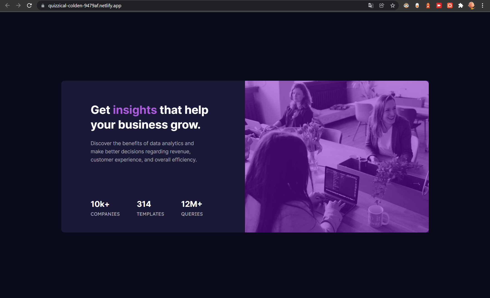

# Frontend Mentor - Stats preview card component solution

This is a solution to the [Stats preview card component challenge on Frontend Mentor](https://www.frontendmentor.io/challenges/stats-preview-card-component-8JqbgoU62). Frontend Mentor challenges help you improve your coding skills by building realistic projects. 

## Table of contents

- [Overview](#overview)
  - [The challenge](#the-challenge)
  - [Screenshot](#screenshot)
  - [Links](#links)
- [My process](#my-process)
  - [Built with](#built-with)
  - [What I learned](#what-i-learned)
  - [Continued development](#continued-development)
  - [Useful resources](#useful-resources)
- [Author](#author)
- [Acknowledgments](#acknowledgments)

## Overview

### The challenge

Users should be able to:

-  View the optimal layout depending on their device's screen size

### Screenshot

### Links

- Live Site URL: [Here](https://quizzical-colden-9479af.netlify.app/)

## My process

### Built with

- Semantic HTML5 markup
- CSS custom properties
- Flexbox
- Mobile-first workflow
- Responsive Design

### What I learned

I learned how use the diferents size of the images in the project.

### Continued development

In future projects I would like to focus on the styles of a website, use methods such as flex and grid, among others.

### Useful resources

- [MDN Web Docs](https://developer.mozilla.org/en-US/docs/Web/CSS) - This helped me to check the right way to use the properties of CSS.

## Author

- Frontend Mentor - [@Dani237](https://www.frontendmentor.io/profile/Dani237)
